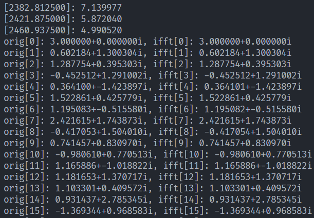

# z-fft

此仓库提供了一个简单易用的傅立叶变换库, 主要提供了9个接口, 分别为`fft`、`ifft`、`rfft`、`irfft`、`dft`、`idft`、`rdft`、`irdft`和`length`, 前8个都是进行傅立叶变换的接口, 最后一个是复数求模函数(用于计算幅度谱)

本仓库自带测试用例和demo程序, 例如[complex_test.c](complex_test.c)、[benchmark.c](benchmark.c)和[demo.c](demo.c)

[demo.c](demo.c)提供了实数傅里叶变换接口的用例, 此用例合成了一个包含三种频率的信号, 然后调用接口计算得到幅度谱, 再使用反变换接口将频谱还原回到原始信号, 并进行检查, 确保反变换还原的信号与原始信号是一致的, 此demo运行结果如下

第一段输出是幅度谱, 格式为`[频率]: 信号强度`

第二段输出是原信号和ifft重建的信号, 格式为`orig: 原信号采样值, ifft: ifft重建的采样值`

  

[complex_test.c](complex_test.c)与[demo.c](demo.c)类似, 不同之处在于, [complex_test.c](complex_test.c)产生的是复数信号, 调用的也是复数变换的接口, 其余行为与[demo.c](demo.c)一致

  

[benchmark.c](benchmark.c)则提供了`dft`与`fft`性能上的差异对比, 此测试案例分别调用`dft`和`fft`的接口, 做相同的**16384**点的变换, 并统计两个算法使用的时间(单位为毫秒), 运行结果如下

其中的数字单位为毫秒, 因此可以看出, `dft`花费了**22492**毫秒才计算完成, 而同样的数据量`fft`仅使用**3**毫秒

前文所述的8个接口可以大致分为`fft`和`dft`两类, `fft`以及所有基于`fft`派生出来的接口均为基2的DIT算法实现的快速变换, 而`dft`以及所有基于`dft`派生出的接口均为傅立叶变换的定义式实现, 两大类在功能上并无差异, 但数据量较大时, `fft`这一类的要比`dft`这一类的运算速度快的多

接口的命名规则为:

1. 变换对象为复数时, 直接使用算法名称, 变换对象为实数时, 在算法名称前增加字母`r`
2. 正变换不加前缀, 反变换增加字母`i`前缀

因此, 8个接口的函数名与功能的对应关系如下

`fft`: 复数快速傅立叶变换(输入复数, 输出复数)  
`ifft`: 复数快速傅立叶反变换(输入复数, 输出复数)

`rfft`: 实数快速傅立叶变换(输入实数, 输出复数)  
`irfft`: 实数快速傅立叶反变换(输入复数, 输出实数)

`dft`: 复数傅立叶变换(输入复数, 输出复数)  
`idft`: 复数傅立叶反变换(输入复数, 输出复数)

`rdft`: 实数傅立叶变换(输入实数, 输出复数)  
`irdft`: 实数傅立叶反变换(输入复数, 输出实数)

所有的算法默认使用`float`作为基本数据类型, 也就是代码中的`Number_t`, 这一点可以通过上层构建系统传入宏定义进行修改, 例如`CMake`语句`set(ZFFT_BASIC_TYPE double)`可将数据类型重新定义为`double`

本仓库默认提供基于`CMake`的构建系统, 正常情况下, 此项目会将[fft.c](./fft.c)编译为动态库, 但也可以直接与其他代码链接到一起, 而其余文件编译为可执行文件. 所有的接口均在[fft.c](./fft.c)中实现, 在[fft.h](./fft.h)中声明, 其余文件则是调用接口实现的各种测试案例, 这些测试案例可直接由`CMake`的`ctest`框架执行并给出测试结果

如果你需要将本仓库集成到你的项目中, 有如下两种方案可选择:

1. 若你自身项目已有与`CMake`不兼容的构建系统, 或你不想使用`CMake`, 则可以仅拷贝[fft.h](./fft.h)、[fft.c](./fft.c)和[LICENSE](./LICENSE)三个文件, 将这三个文件放置在`z-fft`子目录下, 然后将[fft.c](./fft.c)加入到你的构建系统
2. 若你的项目使用了`CMake`作为构建系统, 则可以直接将本仓库的文件下载下来(如果你使用`git`做版本控制, 则可以通过`submodule`的方式引入, 这种方式更好), 然后在上层`CMakeLists.txt`文件内使用`add_subdirectory`将本仓库添加到你的构建系统内

目前本仓库被项目[信号实验箱](https://gitee.com/finalize/signal-test-box)使用, 该项目通过前文所述的第2种方式引入
